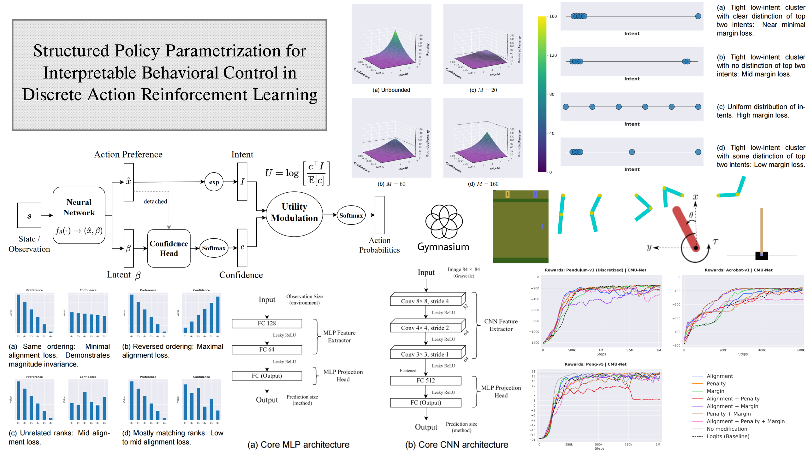
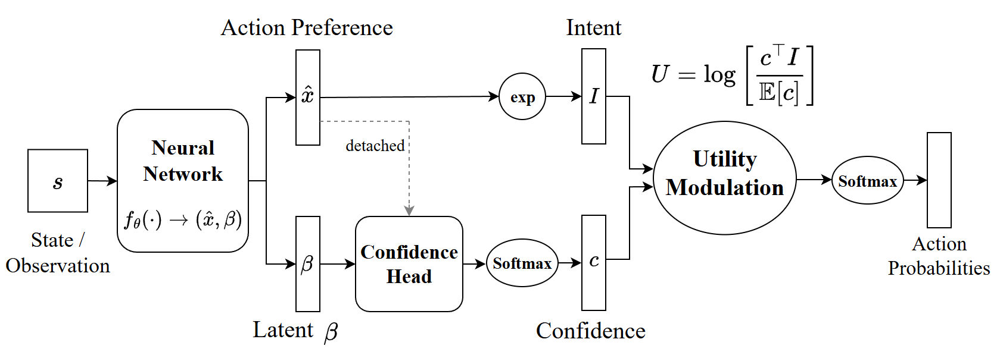
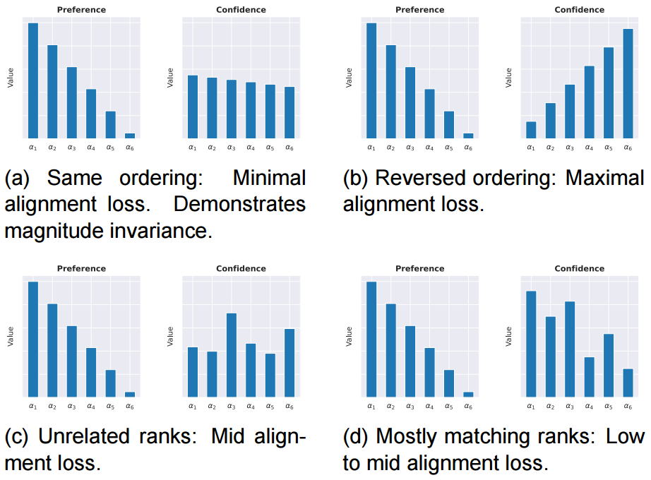
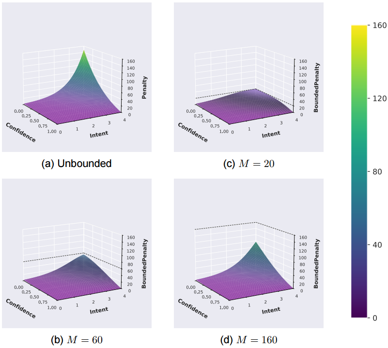
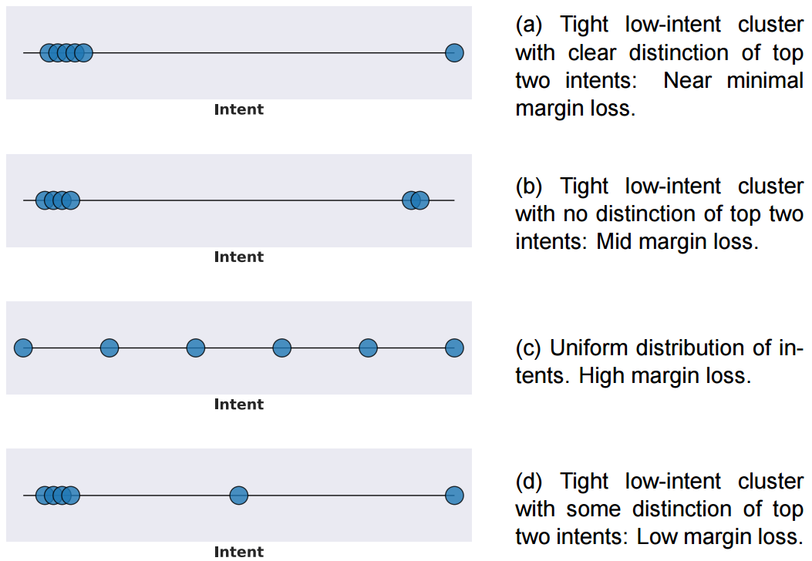
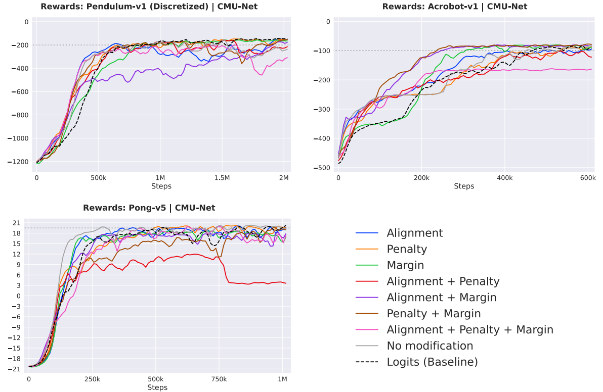

# Structured Policy Parametrization for Interpretable Behavioral Control in Discrete Action Reinforcement Learning



This repository contains the implementation and experimental results of the BSc Thesis **"Structured Policy Parametrization for Interpretable Behavioral Control in Discrete Action Reinforcement Learning"** (University of Athens, 2025).

The primary focus of this work is **SoftTrust**, a novel method for discrete action Reinforcement Learning (RL) that improves interpretability and controllability. By decomposing action utility into **Intent** (what the agent wants to do) and **Confidence** (how sure the agent is), SoftTrust allows for the shaping of exploration behavior through targeted auxiliary objectives.

## 🚀 SoftTrust: Confidence-Modulated Policy Optimization

Modern deep RL often parametrizes discrete policies as a softmax over predicted logits. While effective, this black-box approach obscures the decision-making process. **SoftTrust** introduces the **Confidence-Modulated Utility Network (CMU-Net)**, a dual-head architecture that explicitly separates preference from trust.

### Architecture



The CMU-Net processes the state $s$ through a shared backbone and splits into two heads:
1.  **Preference Head:** Predicts raw, unnormalized preference scores (Intent).
2.  **Confidence Head:** Predicts a normalized probability distribution representing the allocation of trust among actions.

The final utility $U$ is computed by modulating the intent $I$ with the confidence $c$ in log space:

$$U = \log \left[ \frac{c^\top I}{\mathbb{E}[c]} \right]$$

This modulation allows the agent to explicitly communicate not just *which* actions it prefers, but *how confidently* it holds these preferences.

### Auxiliary Optimization Objectives

SoftTrust introduces three auxiliary loss functions that operate on the interpretable Intent and Confidence components. These objectives shape the agent's behavior and stabilize training.

#### 1. Preference-Confidence Alignment
Encourages consistency between the rankings of the Intent and Confidence vectors. It ensures that high-confidence values are allocated to high-intent actions without enforcing a strict magnitude correspondence.



#### 2. Intent-Confidence Penalty
This objective views confidence as a limited resource. It penalizes the model for assigning high confidence to low-intent actions, preventing the confidence vector from collapsing into a uniform distribution.



#### 3. Intent Margin
Promotes decisive behavior by maximizing the separation between the highest predicted intent and the second-highest intent. This reduces "dithering" between similarly valued choices.



---

## 📊 Experimental Results

We evaluated SoftTrust using **Proximal Policy Optimization (PPO)** across varied Gymnasium environments. The evaluation protocol prioritized learning dynamics (stability, convergence speed, AUC) over simple endpoint returns, aggregating results over 5 random seeds.

### Performance Overview



*Figure: Reward curves comparing SoftTrust configurations against the Logits Baseline.*

### Quantitative Comparison

Below are the aggregated metrics for the representative environments. **SoftTrust consistently matched or outperformed the baseline**, offering superior stability and convergence speed in complex control tasks.

#### Pendulum-v1 (Discretized)
*Discretized into 7 bins. Requires smooth policy learning.*

| Method | Convergence Step | Instability | AUC | Score |
| :--- | :--- | :--- | :--- | :--- |
| **CMU-Net (Penalty)** | **32** | 47.29 | -32,707 | **3.61** |
| CMU-Net (Margin) | 39 | **39.68** | -36,887 | 3.48 |
| Logits (Baseline) | 37 | 42.42 | -35,780 | 3.56 |

#### Acrobot-v1
*Sparse, goal-oriented rewards requiring effective exploration.*

| Method | Convergence Step | Instability | AUC | Score |
| :--- | :--- | :--- | :--- | :--- |
| **CMU-Net (Penalty + Margin)** | **39** | 13.67 | **-14,148** | **3.57** |
| CMU-Net (Alignment + Margin) | 40 | 13.58 | -14,405 | 3.46 |
| Logits (Baseline) | 72 | 13.59 | -20,712 | 1.48 |

#### Pong-v5 (ALE)
*High-dimensional visual observation with sparse/delayed rewards.*

| Method | Convergence Step | Instability | AUC | Score |
| :--- | :--- | :--- | :--- | :--- |
| **CMU-Net (No Mod)** | **28** | 1.79 | **1,465** | **3.91** |
| CMU-Net (Penalty) | 48 | **1.68** | 1,303 | 3.44 |
| Logits (Baseline) | 48 | 1.80 | 1,238 | 3.26 |

---

## 📉 Note on Gaussian Neural Networks (GNN)

This repository also contains implementations for **Gaussian Neural Networks (GNN)** and **Multimodal Gaussian Networks (GNN-K)**. These architectures map discrete actions to fixed intervals on a latent axis and predict parameters (mean/variance) to induce locality-biased exploration.

**Experimental Outcome:**
While GNN methods proved effective in simple domains with binary action spaces (e.g., *CartPole-v1*), our experiments demonstrated that the strong locality bias hinders global exploration in more complex environments (e.g., *Pendulum-v1*). The agent often struggled to escape local optima when the optimal policy required non-local switches between actions. Consequently, **SoftTrust** is the recommended method for structured behavioral control in this codebase.

---

## 🛠️ Installation & Usage

### Prerequisites
* Python 3.8+
* PyTorch
* Gymnasium (with ALE for Atari)

### Setup
```bash
git clone https://github.com/Const1357/RL-thesis.git
cd RL-thesis
pip install -r requirements.txt
```

### Running Experiments
To train the agents, use the runner scripts in the `scripts/` directory. Configuration files are stored in `configs/`.

To visualize the **Intent-Confidence Evolution** (as described in the thesis), please visit the interactive viewer hosted [here](https://const1357.github.io/RL-thesis/visuals/Intent-Confidence_visualization.html)

---

## 📝 Citation
If you use this code or methods in your research, please cite the thesis:
```BibTeX
@thesis{Theofylaktou2025Structured,
  title={Structured Policy Parametrization for Interpretable Behavioral Control in Discrete Action Reinforcement Learning},
  author={Theofylaktou, Constantinos},
  school={National and Kapodistrian University of Athens},
  year={2025},
  month={August},
  type={BSc Thesis}
}
```
### Acknowledgments
Supervised by **Prof. Nicholas Kalouptsidis** and PhD Student **Georgios Stamatelis**.


